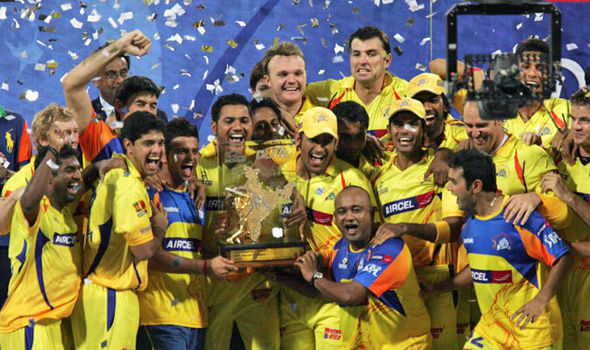
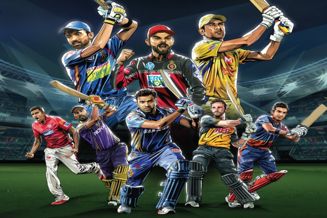
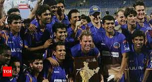

# Indian Premier League

Indian premier league is a professional T20 cricket league conducted in India between 8-10 teams every summer for almost one and half month which has almost players from all countries.

## Teams in IPL

1. Chennai Super Kings
2. Rajasthan Royals
3. Kings XI Punjab
4. Delhi Capitals
5. Mumbai Indians
6. Kolkatta Knight Riders
7. RCB 
8. Deccan Chargers

## Leading runscorers

1. Suresh Raina(csk)
2. Virat Kohli(rcb)
3. Chris Gayle(punjab)

## Leading wickettakers
 
- Dwayne Bravo(csk)
- Lasith Malinga(mi)
- Sunil Narine(kkr)

## Seasons and Winners 

- season1 - Rajasthan Royals

- season2 - Deccan Chargers

- season3 - Chennai SuperKings 

## Reference
To refer you can please check the links given below:

[IPL link](https://akm-img-a-in.tosshub.com/indiatoday/images/story/201903/iplcaptainspledge_2.png?y4inrlEFlqaNMuRmoFHEdXY6RMidL4BB).

[IPL link2](https://www.outlookindia.com/public/upload_share/website/IPL-Captains-Twitter1_327480.jpg).

[IPL video](https://www.iplt20.com/video/144983/final-csk-vs-srh-match-highlights).

